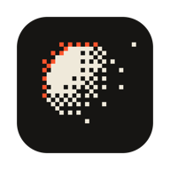

# Dither Lab

A local studio for dithering, halftone screens and ASCII — with bloom, film halation,
chromatic aberration and frame-exact motion export. Runs entirely on your machine; nothing is uploaded.



## Use it

**Double-click `Dither Lab.app`.** It starts a small localhost-only server (if one isn't already running)
and opens the app in its own Chrome window. Drag it to the Dock for one-click access — keep the `.app`
inside this folder, since it serves the `web/` folder next to it.

**Install it as a Chrome app (recommended, once).** With the server running, open <http://localhost:4560>
in Chrome and click the install icon in the address bar (or ⋮ → *Cast, save and share* → *Install page as app*).
Then Dither Lab:
- lives in Launchpad, Spotlight and the Dock like any app,
- opens images and videos from Finder (right-click → *Open With* → *Dither Lab*),
- starts even when the local server isn't running (everything is cached offline).

**Other ways in**
- Terminal: `python3 tools/serve.py --open` (Ctrl-C to stop; `--stop` stops the launcher's background server)
- No server at all: open `web/index.html` directly (works, minus install/offline/Open With)

Drop, paste (⌘V) or open (⌘O) an image, GIF, SVG or video. Your last file and settings come back next time.

## What it does

**Dither modes** (keys `1`–`7`)
- Error diffusion — Floyd–Steinberg, Atkinson, Jarvis–Judice–Ninke, Stucki, Burkes, Sierra, Two-Row Sierra, Sierra Lite; serpentine scan, diffusion amount
- Ordered Bayer 2–16, true void-and-cluster blue noise, threshold, seeded random
- Halftone screens — mono or CMYK, six spot shapes (round, Euclidean, ellipse, diamond, square, line), tone-accurate dot area, dot gain, ink softness, grey-component replacement, per-plate ink / angle / opacity / X-Y misregistration
- ASCII — glyph sets or your own, auto-sorted by measured ink density, any installed monospace font, palette or source colour
- *Crawl* re-dithers every frame for a living, boiling texture

**Palette** — one strip, shadows → highlights (a gradient map). Tone-map or nearest-colour (OKLab) quantisation,
OKLab ramp interpolation to N levels, *place by lightness* for tone-accurate mapping, an OKLCH editor per swatch,
k-means extraction from the image, a palette library, paste/copy hex lists.

**Tone** — Lightroom-style curve over a live histogram, exposure (EV), contrast, black/white point,
pre-dither sharpen/soften, saturation/hue for colour modes, optional linear-light dithering.

**Light & motion (GPU)** — mip-chain bloom (threshold, knee, radius, tint, core, grain), a separate film-halation
pass, radial/linear chromatic aberration, shimmer, wave warp, glitch, film grain, vignette, scanlines, prism wash.
Every motion effect completes whole cycles within *Loop length*, so exports loop seamlessly.

**Export** (⌘E · quick PNG ⇧⌘E · copy ⌘C)
- PNG / WebP at 1–4× with crisp pixels and real transparency (source alpha or knocked-out paper)
- SVG — vector pixel paths, halftone dot plates (multiply-blended), or ASCII text
- MP4 (H.264 via WebCodecs — frame-exact, faster than real time), PNG sequence (.zip), ASCII .txt

## Working

| | |
|---|---|
| Drag / two-finger scroll | pan |
| Pinch, ⌘-scroll, ⌘± | zoom · `Z` fit ↔ 100% · ⌘0 fit · ⌘1 100% · double-click toggles |
| `Y` / hold `\` | before-after split / show original |
| `[` `]` | pixel · cell · glyph size |
| `Space` · `,` `.` | play/pause · step frame |
| ⌘Z / ⇧⌘Z | undo / redo (full history in the left panel) |
| ⌘S | save the current look as a preset |
| `Tab` | hide panels · ⌥-click a panel title to solo it |

Sliders: drag the label to scrub, hold ⇧ for fine control, double-click to reset, click the number to type
(↑/↓ nudge). Hover a preset to preview it on the image; click to apply. Presets never change output width.

## Layout

```text
Dither Lab.app/     macOS launcher (starts tools/serve.py, opens the app window)
web/                the app — everything that gets served
  index.html          shell
  styles.css          UI
  manifest.json       installable-app manifest (icons, Finder file handlers)
  sw.js               offline cache
  icons/              app icons
  js/util.js          colour science (sRGB, OKLab/OKLCH), curves, RNG
  js/engine.js        tone stage, dithering, blue noise, ASCII, halftone LUTs, palette extraction
  js/gl.js            WebGL2 renderer: base → FX → bloom/halation → composite → viewer
  js/export.js        MP4 muxer, ZIP writer, SVG builders
  js/ui.js            sliders, curve, palette strip, menus
  js/app.js           state, presets, history, sources, viewer, export flows
tools/
  serve.py            localhost server (127.0.0.1:4560, no-cache, exits after 12 h idle)
  make-icons.py       regenerates web/icons and the launcher's AppIcon.icns
```

**Releasing a change:** bump the version in `web/index.html` (`?v=`), `web/sw.js` (`VERSION` and the `?v=` list)
and `Dither Lab.app/Contents/Info.plist`, so installed copies pick it up.

Requires a current browser with WebGL2; MP4 export needs WebCodecs (Chrome, Safari 16.4+, Firefox 130+) and falls
back to real-time WebM elsewhere. Video audio isn't carried into exports. The launcher needs Python 3
(bundled with the Xcode Command Line Tools).

## License

MIT
